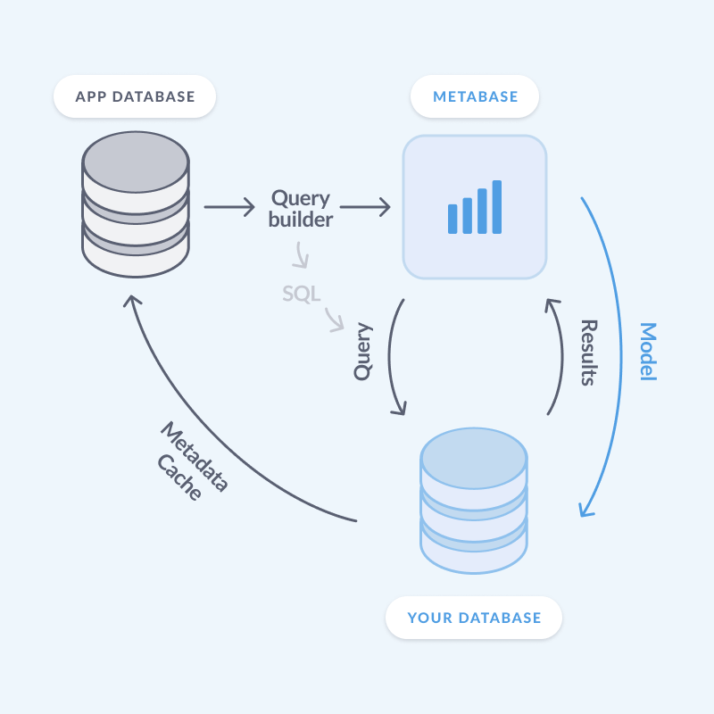
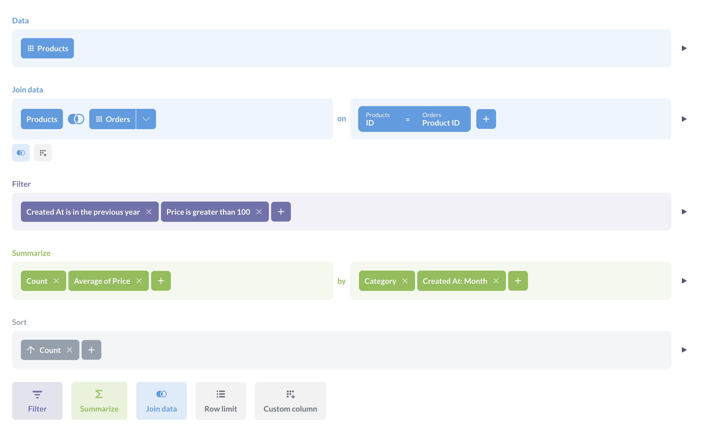
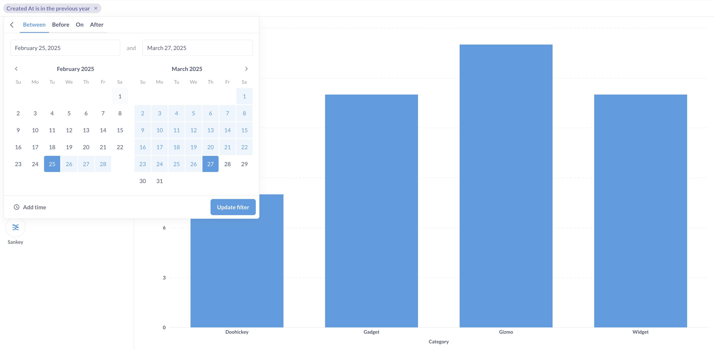
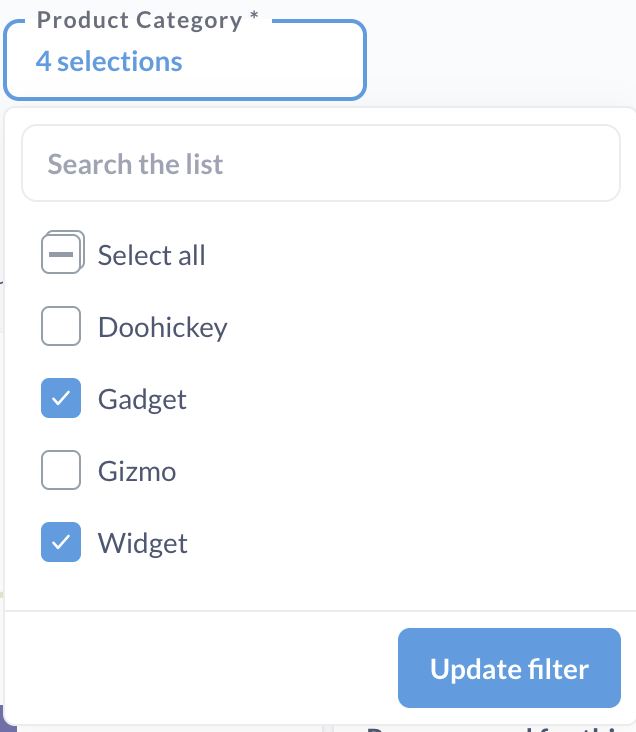

## Metabase doesn't store your data

Metabase is a tool for querying data in a database and visualizing the results (Metabase is also many [other things](/learn/metabase-basics/overview/tour-of-metabase), but that's not our focus right now). But it's not like some other BI tools that store your data. With Metabase, the basic set up is:

- You connect Metabase to your database.
- You write a query in Metabase (either in the query builder or native code editor)
- Metabase sends the SQL over to the database.
- Your database processes the query, then sends the results back to Metabase.
- Metabase turns your data into pretty colors (a chart on a dashboard).

Metabase itself doesn’t pull your data out of your database to process your query - all that processing happens _inside_ your database. All that Metabase sees is the query that you write, and the results that the query returns.

There are a couple of nuances to this, as Metabase does do some lightweight querying of your database's metadata so that it knows how to handle the results the database returns to it. So let's go through it.

## Querying your database with Metabase

There are two ways to create queries in Metabase: using SQL (or if you’re connecting to MongoDB, the MongoDB query language), and using the graphical query builder.

### Native queries

When you write a query in SQL (or in MongoDB query language), Metabase just sends that query on its merry way to your database.

The code that you write in the native editor is like a black box: Metabase doesn’t parse your SQL, so it doesn’t know about what’s actually going on in your query, like which tables you’re joining, which columns you’re selecting, or how you filter and aggregate your data. And because the query is a black box, Metabase can't know much about the results either, so it can't offer things like breakouts, drill-down, or automatic charts.

### Query builder

In the [query builder](/learn/metabase-basics/getting-started/ask-a-question), you assemble a query from building blocks like joins, filters, or summaries.

If you use the query builder, however, then Metabase knows exactly what's going on in your query - what tables are involved, what are the column types, what operations you perform and which order - and it can use that info to give you more functionality. For example, if Metabase knows that you have an aggregation in your query, it can give you an option to disaggregate the results - so, to [drill down](/learn/metabase-basics/querying-and-dashboards/questions/drill-through) to individual records; or, if Metabase sees that you're filtering on a date column, it can give you a calendar widget; if it notices that you’re grouping by a categorical variable, it can automatically build a bar chart with those categories.

All these button clicks in the query builder translate into SQL that’s sent to your database (and you can [see the SQL that it generates](/docs/latest/questions/query-builder/editor#viewing-the-native-query-that-powers-your-question)) but having access to each individual query element is what makes much of the Metabase magic happen.

But now you might ask: but if Metabase doesn't store my data, how does it _know_ that I have a date column, or what categories I have?

## How Metabase knows about your data

Metabase uses [syncs](/docs/latest/databases/sync-scan#how-database-syncs-work) to learn about your database schema: stuff like what tables are in the db, what are their columns and types, etc. Syncs are still, down on the basic level, queries that Metabase sends and your database executes, but it's a special kind of query: instead of returning the data itself, these queries return metadata.

Metabase also runs [scans](/docs/latest/databases/sync-scan#how-database-scans-work) to take samples of values in columns. This allows Metabase to give you stuff like dropdown options in filters.

Worth noting that Metabase only takes _samples_ from columns, it doesn’t store complete columns - they stay in your database. And it only scans fields that people use (e.g., the values for a field used in a filter on a dashboard). You can also turn these syncs off.

Because Metabase needs to know information about your data _before_ you send a query to your database query (so that it could give you a calendar widget for a date column), it needs to store this info somewhere and update it periodically. That place is the Metabase _application database_.

## Metabase application database

Metabase's [application database](/docs/latest/installation-and-operation/configuring-application-database) is a database (separate from the databases you connect Metabase to) where Metabase keeps all of its app data: people's accounts, settings, saved questions, logs - as well as the metadata about your connected databases (like columns and their types).

When you build a query the query builder, Metabase can look up the information about your data in the application database, use that information to give you filter widgets, charts types, and drill downs.

(If you’re on Metabase Cloud, you never have to think about the application database - Metabase Cloud handles it for you. But if you’re self-hosting, you’ll need to provision a separate database to serve as an application database.)

## Caching query results

Maybe there’s a dashboard that everyone on your team looks at regularly, like a dashboard with company metrics. Each time someone opens the dashboard, Metabase will send the queries to database, make the database execute them, and retrieve the results. But if the results don’t change frequently - for example, maybe you’re displaying quarterly metrics that only change once every three months - there's no need to make the database recompute these numbers every day.

You can tell Metabase to [cache results](/docs/latest/configuring-metabase/caching) in its application database (not your connected database). This way, when someone goes to the cached dashboard, the dashboard will load faster because your database will just return the pre-computed results to Metabase.

Metabase will cache _results only_. So for example, if you query computes the number of items sold last month, Metabase will cache only _that number_, and not data about the items. Your data is still in your database.

## Persisting models back to your database

Metabase has [models](/learn/metabase-basics/getting-started/models) - derived datasets that you build inside Metabase to make it easier for people to ask questions. To build a model, you write a query (either in SQL or using the query builder), and then people can use that model as a data source as if it were a table.

Because models are built from queries, Metabase needs to do some additional processing whenever someone asks a question based on a model. For example, if someone asks for the count of orders in the Orders model, the query that's sent to the database is more complicated than just `SELECT COUNT(*) FROM orders` because the Orders model is itself defined by a query.

This can get expensive and time-consuming for large models, so for some databases, you can turn on [model persistence](/docs/latest/data-modeling/model-persistence), which is where Metabase stores these models in your database as real tables. So for example, if you persist your Orders model, then Metabase will create an actual `orders` table in your database (well, it won't be called `orders` exactly, but you get the point) and whenever someone asks for the count of orders in the Orders model, your database can just return that pre-computed table.

## Next steps

- [Adding and managing database](/docs/latest/databases/connecting)
- [Syncing and scanning databases](/docs/latest/databases/sync-scan)
- [Configuring Metabase application database](/docs/latest/installation-and-operation/configuring-application-database)
- [Caching query results](/docs/latest/configuring-metabase/caching)
- [Model persistence](/docs/latest/data-modeling/model-persistence)
